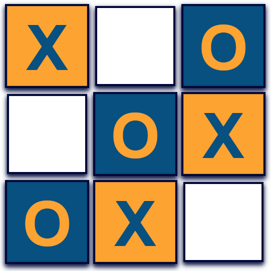

## Demo
A live demo can be found [here](https://spagettileg.github.io/crater-crossed/).

***

## Table of Contents
1. [UXD Considerations](#uxd-considerations)
    * [User](#user)
    * [Crater-Crossed](#crater-crossed)
    * [Wireframes](#wireframes)
    * [User Stories](#user-stories)
    * [CSS Framework](#css-framework)
    * [Colour Palette](#colour-palette)
    * [Typography](#typography)
    * [Icon Graphics](#icon-graphics) 
2. [Technologies Applied](#technologies-applied)
    * [Languages](#languages)
    * [Libraries](#libraries)
    * [Tools](#tools)
    * [Hosting](#hosting)
3. [Features](#features)
    * [Features Left to Implement](#features-left-to-implement) 
4. [Tests](#tests)
5. [Deployment](#deployment)
    * [Local Deployment](#local-deployment)
6. [Credits](#credits)
    * [Content](#content)

## UXD Considerations
### Ambition
To create an addictive and competitive game based upon an age old classic 'tic-tac-toe'. 

#### User
- An attractive, yet simple design to encourage game play over a short period of time 
- Game play to be restricted to 1 screen
- A quick game reset function helps with continuous game play
- Access to live game history and profide an opportunity for players to unpick their last move. if that same move had been made in error
- Game moves can be sorted in either ascending or descending order

#### Crater-Crossed

## Wireframes
My wireframe mock-up design have been created in [Balsamiq](https://balsamiq.com/) to showcase the 'Crater-Crossed' website responsiveness on mobile, tablet and desktop devices.

- [Crater-Crossed](https://spagettileg.github.io/crater-crossed/)

## User Stories
> I need an game that is quick and provides a win, lose or draw outcome  

> The game should allow 2 players to compete 

> The identification of the 2 players should be made visible

> The game should feature on a simple 3x3 grid

> Each player must be assigned either an 'X' or 'O' to keep track of their moves

### CSS Framework
Bootstrap was the chosen framework for styling my project. I used the bootstrap grid extensively to support responsiveness on mobile, tablet and desktop devices.  

### Colour Palette
Colours used for **Crater-Crossed** were sourced from [colorhunt](https://colorhunt.co/). The choice of colour palette support key gaming attributes of fun, co-ordination, decision making and competition. 

Colour        |  Hex Code
--------------|--------------
Yellow        | #FFA41B
Dark Blue     | #000839
Med Blue      | #005082
Light Blue    | #00A8CC

### Typography
[Century Gothic](https://fonts.google.com/), [Futura](https://fonts.google.com/)  & [Sans Serif](https://fonts.google.com/) fonts were used throughout this project.

### Icon Graphics
No additional styling via fontawesome or materialize was required for this project

## Technologies Applied
### Languages
•	[HTML5](https://html.spec.whatwg.org/multipage/) used as the markup language

•	[CSS3](https://www.w3.org/Style/CSS/) used to style the HTML

•	[React.js](https://reactjs.org/) used as declararive views make the code more predictable, component logic enables rich data to be passed through the app and keep state out of the DOM.

### Libraries
•	[Google Fonts](https://fonts.google.com/) provided the fonts used throughout the project

•	[jQuery](https://jquery.com/) is used to manipulate the DOM, for example buttons, and showing / hiding elements

### Tools
•	[AWS Cloud9](https://aws.amazon.com/cloud9/) a cloud-based integrated development environment (IDE) that lets you write, run, and debug your code with just a browser.

•	[Git](https://git-scm.com/) is a free and open source distributed version control system designed to handle everything from small to very large projects with speed and efficiency.

•	[GitHub](https://github.com/) is a code hosting platform for version control and collaboration. It lets you and others work together on projects from anywhere.

•	[Balsamiq](https://balsamiq.com/) is a small graphical tool to sketch out user interfaces, for websites and web / desktop / mobile applications and used to visualise my project through mock-up design.

### Hosting
•	[GitHub Pages](https://pages.github.com/) is used to host the deployed application - 'Crater-Cross'

## Features
1. All 9 gaming squares rotate 90 degrees prior to start of play. Move is designed to create further visual interest for a game that historically lacks features
2. Player X always starts the game. They are identified with a blue "X" on a yellow background
3. Player O takes the next move. They are identified with a yellow "O" on a blue background
4. A reset button can return the game to the start at any given time
5. Player turns are confirmed in a clear text narrative. This is continuousuntil game has been won or drawn
6. Live game history is recorded. Players can restart the game at any given point
7. Game moved can be sorted in either ascending or descending order
8. Either 3 XXX or OOO in a row will determine the winner
9. Footer sets out the website authors credentials

### Features Left to Implement
1. Sound options for game initiation, in-game moves & game outcome (win/draw) to be added
2. Game time to be controlled by timer per move to ensure quick game time

## Testing
Test analysis and reporting can be viewed in a separate [TESTS.md](https://github.com/Spagettileg/crater-crossed/blob/master/TESTS.md) file.

## Deployment
This project was developed using the [AWS Cloud9 IDE](https://aws.amazon.com/cloud9/), committed to git and pushed to GitHub using the built in function within cloud9.

To deploy this page to GitHub Pages from its [GitHub repository](https://github.com/Spagettileg/crater-crossed), the following steps were taken:

1. Log into GitHub
2. From the list of repositories on the screen, select **Spagettileg/crater-crossed**
3. From the menu items near the top of the page, select **Settings**
4. Scroll down to the **GitHub Pages** section
5. Under **Source** click the drop-down menu labelled **None** and select **Main Branch**
6. On selecting Main Branch the page is automatically refreshed, the website is now deployed
7. Scroll back down to the **GitHub Pages** section to retrieve the link to the deployed website
8. Add `homepage` to `package.json` file

- `"homepage": "https://spagettileg.github.io/crater-crossed/",`  

9. Key `npm install --save gh-pages` in bash ubuntu terminal window. The user will see the following response;

- `gh-pages@3.1.0` 

10. Add the following scripts to `package.json` file;

`"predeploy": "npm run build",`
`"deploy": "gh-pages -d build",`

At the moment of submitting this project the Development Branch and Master Branch are identical.

### Local Deployment
To clone this project from GitHub:

1. Follow this link to the [Project GitHub repository](https://github.com/Spagettileg/crater-crossed)
2. Under the repository name, click **"Clone or download"**
3. In the **Clone with HTTPs section**, copy the clone URL for the repository
4. In your local IDE open **Ubuntu Bash**
5. Change the current working directory to the location where you want the cloned directory to be made
6. Type `git clone`, and then paste the URL you copied in Step 3

`git clone https://github.com/USERNAME/REPOSITORY`

7. Press Enter. Your local clone will be created.

To run a React app, then **node package manager** (npm) needs to be installed. This is a dependency management tol for Javascript applications. This tool will help to install and the libraries and other tools to support React development.  

1. Install **nodejs** - Set up PPA (personal package archive)
 
    - `cd~`
    - `curl -sL https://deb.nodesource.com/setup_10.x -o nodesource_setup.sh`

2. Run the downloaded script using below command

    - `sudo bash nodesource_setup.sh`

3. Install

    - `sudo apt-get install nodejs -y`

4. Testing nodejs installation

    - `node -v`
    - Current version will appear in console window i.e. `v10.15.1`
    - `npm -v`
    - Current version will appear in console window i.e. `v6.4.1`

5. Install create react app

    - `npm install -g create-react-app`

6. Test create-react-app

    - `create-react-app --version`
    - Current version will appear in console window i.e. v.2.3.1
    
To run the react application, key `npm start` in console.

Further reading and troubleshooting on cloning a repository from [GitHub](https://help.github.com/en/github/creating-cloning-and-archiving-repositories/cloning-a-repository)

## Credits

### Content

Orignal [tic-tac-toe](https://reactjs.org/tutorial/tutorial.html) code snippet sourced from React Tutorials. The code was then modified to include the following:

- Draw outcome notification
- Display the location for each move in the format (col, row) in the move history list
- Added a toggle button that lets you sort the moves in either ascending or descending order
- Highlight x3 winning squares when a player wins

**This is for educational use.** 
